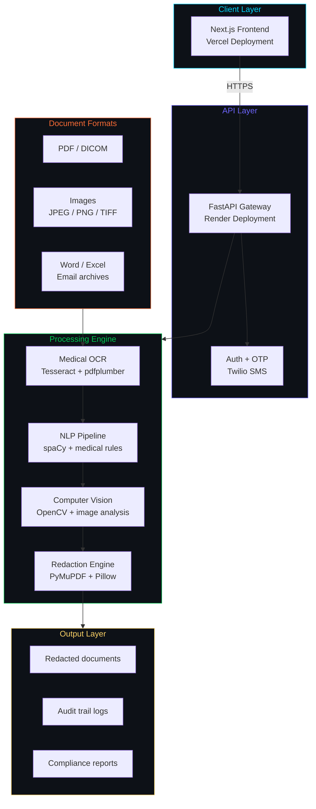
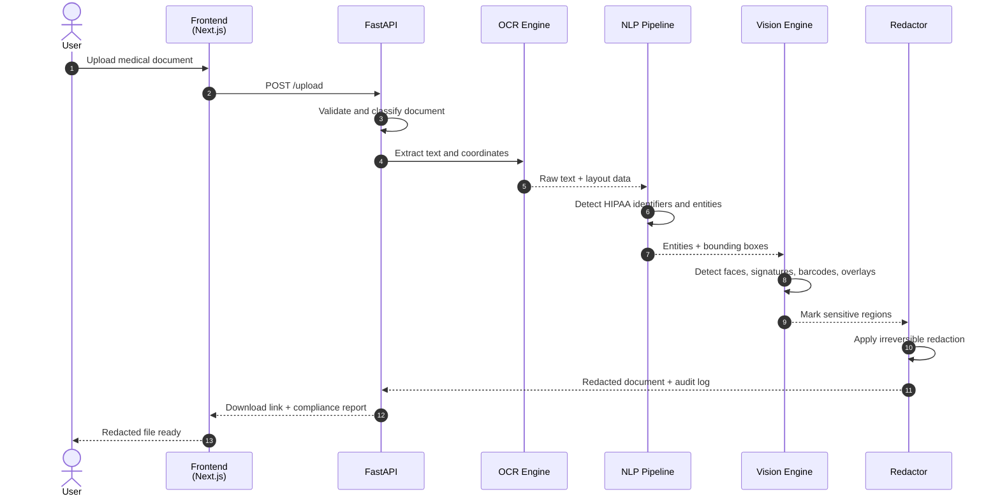
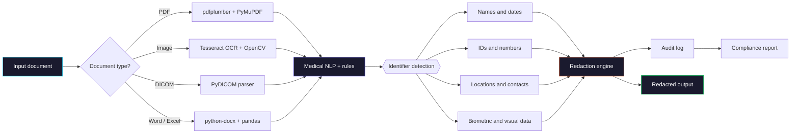
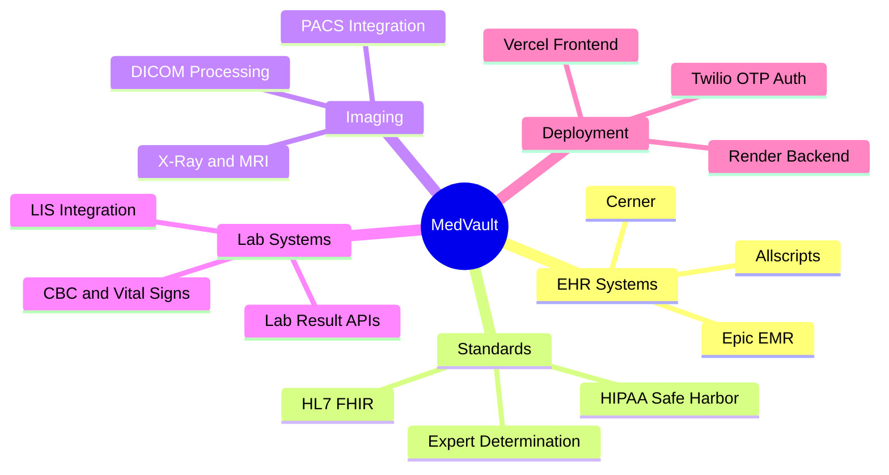

<div align="center">


<br/>

[](https://medvault-medical-privacy-protection-pipeline-final-adm7pemqz.vercel.app/)
[](./SETUP_GUIDE.md)
[](https://python.org)
[](https://fastapi.tiangolo.com/)
[](https://nextjs.org/)

<br/>

**Privacy is not a barrier to progress. It is the foundation of trust in healthcare.**

</div>

---

## Preview

<div align="center">

<a href="https://medvault-medical-privacy-protection-pipeline-final-adm7pemqz.vercel.app/">
  
</a>

<br/>

<sub>Click the preview to open the live deployment.</sub>

</div>

---

## What Is MedVault?

**MedVault** is an AI-powered healthcare document privacy platform for redacting sensitive patient information from medical documents. It combines OCR, NLP, computer vision, and a FastAPI/Next.js application stack to help process healthcare files while preserving auditability and document usability.

It is designed for workflows such as patient portal sharing, clinical research preparation, insurance processing, legal discovery, and internal healthcare compliance review.

<div align="center">

| Privacy-first | AI-powered | Healthcare-aware | Audit-ready |
|:--:|:--:|:--:|:--:|
| HIPAA Safe Harbor workflow support | OCR + NLP + vision | PDFs, images, DICOM, clinical files | Processing logs and reports |

</div>

---

## Highlights

<table>
<tr>
<td width="50%">

### Document Intelligence

- PDF, scanned image, DICOM, Word, Excel, and email archive support
- Automatic document classification for clinical notes, lab reports, claims, and consent forms
- Multi-page and batch document processing
- Layout-preserving redaction output

</td>
<td width="50%">

### AI Redaction Pipeline

- Detection for HIPAA identifiers and medical-specific PII
- OCR for scanned documents and image-based files
- NLP entity recognition with medical context
- Computer vision for faces, signatures, IDs, barcodes, and overlays

</td>
</tr>
<tr>
<td width="50%">

### Privacy Modes

- Patient portal mode
- Research sharing mode
- Insurance processing mode
- Legal discovery mode
- Custom privacy rules for enterprise workflows

</td>
<td width="50%">

### Compliance Support

- Safe Harbor identifier checks
- Audit trail generation
- Redaction reports
- Date shifting and synthetic replacement workflows
- Disclosure-risk review support

</td>
</tr>
</table>

---

## Privacy Modes

| Mode | What it does | Best for |
|---|---|---|
| **Patient Portal** | Removes unrelated patient data while preserving the requesting patient's useful context | Patient self-service records |
| **Research Sharing** | Applies stronger de-identification and synthetic demographic replacement | Clinical research datasets |
| **Insurance Processing** | Keeps claim-relevant data and removes excess clinical detail | Payer and claim workflows |
| **Legal Discovery** | Adds comprehensive redaction and privilege-aware handling | Legal review and discovery |
| **Custom** | Allows configurable privacy rules | Organization-specific workflows |

---

## Architecture



---

## Processing Workflow



---

## HIPAA-Aware Redaction Flow



---

## Tech Stack

<div align="center">

### Backend

[](https://fastapi.tiangolo.com/)
[](https://python.org)
[](https://spacy.io/)
[](https://opencv.org/)
[](https://www.uvicorn.org/)
[](https://twilio.com/)

### Frontend

[](https://nextjs.org/)
[](https://typescriptlang.org/)
[](https://tailwindcss.com/)
[](https://recharts.org/)
[](https://axios-http.com/)

### Deployment

[](https://vercel.com/)
[](https://render.com/)
[](https://sqlalchemy.org/)

</div>

---

## Integration Ecosystem



---

## Quick Start

For detailed setup instructions, see the [full setup guide](./SETUP_GUIDE.md).

### Prerequisites

| Requirement | Version | Notes |
|---|---:|---|
| Python | `3.12.5` | See `.python-version` |
| Node.js | `18+` | LTS recommended |
| Poppler | Latest | Required for `pdf2image` |
| Tesseract OCR | Latest | Required for image OCR |
| Twilio account | Any active account | Required for OTP SMS authentication |

### Backend

```bash
cd backend
pip install -r requirements.txt
python -m spacy download en_core_web_sm
python -m spacy download en_core_web_md
python main.py
```

### Frontend

```bash
cd frontend
npm install
npm run dev
```

### Local URLs

| Service | URL |
|---|---|
| Frontend | `http://localhost:3000` |
| Backend API | `http://localhost:8000` |
| API Docs | `http://localhost:8000/docs` |

---

## Project Structure

```text
medvault/
|-- backend/
|   |-- main.py
|   |-- requirements.txt
|   |-- Procfile
|   |-- apt.txt
|   |-- test_doc_create.py
|   `-- medvault_test_files/
|
|-- frontend/
|   |-- app/
|   |-- components/
|   |-- hooks/
|   |-- lib/
|   |-- styles/
|   |-- types/
|   `-- package.json
|
|-- SETUP_GUIDE.md
|-- setup.txt
|-- requirements.txt
`-- README.md
```

---

## Testing

Generate sample healthcare test files:

```bash
cd backend
python test_doc_create.py
```

Sample files are available in:

```text
backend/medvault_test_files/
```

---

## Deployment

| Layer | Platform | Link |
|---|---|---|
| Frontend | Vercel | [Live demo](https://medvault-medical-privacy-protection-pipeline-final-adm7pemqz.vercel.app/) |
| Backend | Render | See `backend/deployed.txt` |

<div align="center">

[](https://medvault-medical-privacy-protection-pipeline-final-adm7pemqz.vercel.app/)
[](./SETUP_GUIDE.md)


</div>
