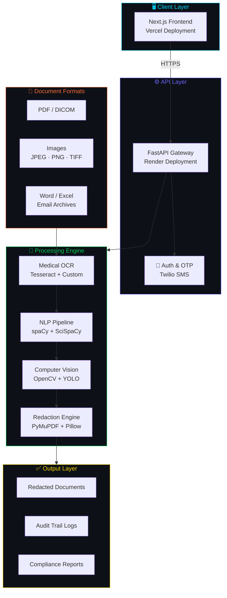
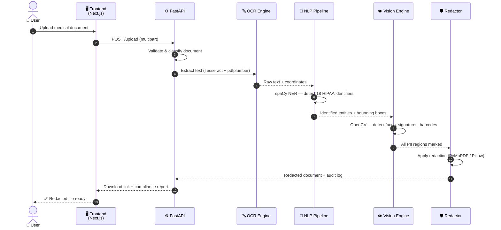
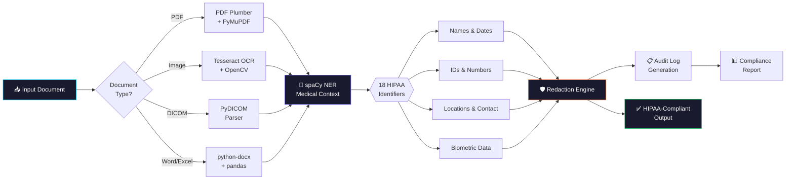
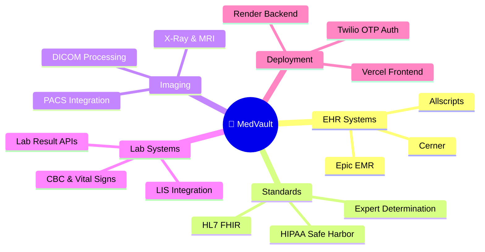

<div align="center">

# 🏥 MedVault

### Healthcare Document Privacy Pipeline
**AI-Powered · HIPAA Compliant · Medical-Grade Redaction**

<br/>

[](https://medvault-medical-privacy-protection-pipeline-final-adm7pemqz.vercel.app/)
[](./SETUP_GUIDE.md)
[](https://python.org)
[](https://fastapi.tiangolo.com/)
[](https://nextjs.org/)
[](#compliance)

<br/>

> *"Privacy is not a barrier to Progress — It is the Foundation of Trust in Healthcare."*

</div>

---

## 📋 Table of Contents

- [Overview](#-overview)
- [Key Features](#-key-features)
- [System Architecture](#-system-architecture)
- [Processing Workflow](#-processing-workflow)
- [Tech Stack](#-tech-stack)
- [HIPAA Compliance](#-hipaa-compliance)
- [Integration Ecosystem](#-integration-ecosystem)
- [Quick Start](#-quick-start)
- [Deployment](#-deployment)

---

## 🏥 Overview

**MedVault** is an enterprise-grade healthcare document privacy platform that transforms how medical organizations handle sensitive patient information. By combining **advanced AI**, **computer vision**, and **NLP pipelines**, MedVault eliminates the error-prone manual redaction processes that threaten patient privacy and HIPAA compliance.

<div align="center">

| 🔒 Privacy-First | ⚡ AI-Powered | 🔗 EHR Integration | 📊 Audit Trails |
|:---:|:---:|:---:|:---:|
| Full HIPAA Safe Harbor | NLP + Computer Vision | Epic, Cerner, FHIR | Immutable Logs |

</div>

---

## ✨ Key Features

### 📄 Document Processing

<table>
<tr>
<td width="50%">

**Multi-Format Ingestion**
- 📑 PDFs (searchable & scanned)
- 🖼️ Images — JPEG, PNG, TIFF, BMP
- 🩺 DICOM medical imaging files
- 📝 Word, Excel & Email archives

</td>
<td width="50%">

**Intelligent Classification**
- 🏷️ Auto-detect discharge summaries
- 🧪 Lab reports & insurance claims
- 📋 Consent forms & clinical notes
- 📦 Batch processing with tracking

</td>
</tr>
</table>

---

### 🔬 AI-Powered Entity Recognition

<table>
<tr>
<td width="33%">

**🧠 PII Detection**
- All 18 HIPAA identifiers
- Medical-context awareness
- Insurance info extraction
- Date & time intelligence

</td>
<td width="33%">

**👁️ Computer Vision**
- Face detection & blurring
- Signature identification
- Medical scan processing
- ID card recognition

</td>
<td width="33%">

**🔤 OCR & NLP**
- Medical-enhanced OCR
- Handwriting recognition
- Multi-language support
- Prescription parsing

</td>
</tr>
</table>

---

### 🛡️ Privacy Modes

| Mode | Description | Use Case |
|------|-------------|----------|
| 🏥 **Patient Portal** | Removes other patients' info, preserves own | Patient self-service portals |
| 🔬 **Research Sharing** | Full de-identification + synthetic demographics | Clinical research datasets |
| 💼 **Insurance Processing** | Keeps claim-relevant data only | Insurance adjudication |
| ⚖️ **Legal Discovery** | Comprehensive redaction + privilege protection | Legal proceedings |
| ⚙️ **Custom** | Fully configurable privacy levels | Enterprise use cases |

---

## 🏗️ System Architecture



---

## 🔄 Processing Workflow



---

## 🔒 HIPAA Compliance Pipeline



---

## 🛠️ Tech Stack

<div align="center">

### Backend
[](https://fastapi.tiangolo.com/)
[](https://python.org)
[](https://spacy.io/)
[](https://opencv.org/)
[](https://www.uvicorn.org/)
[](https://twilio.com/)

### Frontend
[](https://nextjs.org/)
[](https://typescriptlang.org/)
[](https://tailwindcss.com/)
[](https://recharts.org/)
[](https://axios-http.com/)

### Deployment & Services
[](https://vercel.com/)
[](https://render.com/)
[](https://sqlalchemy.org/)

</div>

---

## 🔗 Integration Ecosystem



---

## ⚡ Quick Start

> 📖 **For detailed step-by-step instructions with screenshots, visit the [📋 Full Setup Guide](./SETUP_GUIDE.md)**

### Prerequisites

| Requirement | Version | Notes |
|-------------|---------|-------|
| Python | `3.12.5` | See `.python-version` |
| Node.js | `18+` | LTS recommended |
| Poppler | Latest | Required for `pdf2image` |
| Tesseract OCR | Latest | Required for image OCR |
| Twilio Account | — | For OTP SMS authentication |

### 1️⃣ Clone & Setup Backend

```bash
# Clone the repository
git clone https://github.com/your-org/medvault.git
cd medvault/backend

# Install Python dependencies
pip install -r requirements.txt

# Download spaCy language models
python -m spacy download en_core_web_sm
python -m spacy download en_core_web_md

# Configure environment variables
cp .env .env.local   # Fill in your Twilio credentials

# Start the backend server
python main.py
```

### 2️⃣ Setup Frontend

```bash
cd ../frontend

# Install all dependencies
npm install

# Start the development server
npm run dev
```

### 3️⃣ Access the Application

| Service | URL |
|---------|-----|
| 🖥️ Frontend | `http://localhost:3000` |
| ⚙️ Backend API | `http://localhost:8000` |
| 📖 API Docs | `http://localhost:8000/docs` |

> 💡 **Need the full `.env` variable list?** Check [`backend/.env`](./backend/.env) and the [Setup Guide](./SETUP_GUIDE.md).

---

## 🌐 Deployment

| Layer | Platform | Status |
|-------|----------|--------|
| 🖥️ Frontend | [Vercel](https://vercel.com) | [](https://medvault-medical-privacy-protection-pipeline-final-adm7pemqz.vercel.app/) |
| ⚙️ Backend | [Render](https://render.com) | [](#) |

### 🚀 Try the Live Demo

<div align="center">

[](https://medvault-medical-privacy-protection-pipeline-final-adm7pemqz.vercel.app/)

</div>

---

## 📂 Project Structure

```
medvault/
├── 📁 backend/
│   ├── main.py                  # FastAPI application entry point
│   ├── requirements.txt         # Python dependencies
│   ├── .env                     # Environment variable template
│   ├── .python-version          # Python version pin (3.12.5)
│   ├── Procfile                 # Render deployment config
│   ├── apt.txt                  # System-level dependencies
│   ├── test_doc_create.py       # Test document generator
│   └── 📁 medvault_test_files/  # Sample documents for testing
│
├── 📁 frontend/
│   ├── 📁 app/                  # Next.js app directory
│   ├── 📁 components/           # Reusable UI components
│   ├── 📁 hooks/                # Custom React hooks
│   ├── 📁 lib/                  # Utility functions
│   ├── 📁 styles/               # Global styles
│   ├── 📁 types/                # TypeScript type definitions
│   └── package.json             # Node.js dependencies
│
├── QR.png                       # QR code for live demo
├── setup.txt                    # Quick setup reference
├── SETUP_GUIDE.md               # 📖 Full detailed setup guide
└── README.md                    # This file
```

---

## 🧪 Testing

```bash
# Generate test documents (PDFs, Word, images)
cd backend
python test_doc_create.py

# Sample test files are available in:
# backend/medvault_test_files/
```

---

---

<div align="center">

**🏥 MedVault** · Built with ❤️ for Healthcare Privacy

[](https://medvault-medical-privacy-protection-pipeline-final-adm7pemqz.vercel.app/)
[](./SETUP_GUIDE.md)

*"Privacy is not a barrier to Progress — It is the Foundation of Trust in Healthcare."*

</div>
MedVault: Healthcare Document Privacy Pipeline
MedVault is a comprehensive healthcare document privacy platform that transforms how medical organizations handle sensitive information. By leveraging advanced AI and seamless integration with existing healthcare systems, MedVault eliminates the time-consuming, error-prone manual redaction processes that currently plague the healthcare industry.

MedVault operates through a sophisticated multi-layer processing system that ingests various document types, applies intelligent analysis, and produces privacy-compliant outputs with comprehensive audit trails.

MedVault: Complete Feature List

Core Processing Features

Document Processing Capabilities
Multi-Format Document Ingestion - Supports PDFs (searchable and scanned), images (JPEG, PNG, TIFF, BMP), DICOM files, Word documents, Excel spreadsheets, email archives
Intelligent Document Classification - Automatically identifies document types (discharge summaries, lab reports, insurance claims, consent forms, etc.)
Batch Processing - Handle multiple documents simultaneously with progress tracking
Multi-Page Document Support - Process complex multi-page medical records seamlessly
Format Preservation - Maintains original document layout and formatting after redaction
Document Relationship Mapping - Understands connections between related medical documents

Advanced OCR & Text Recognition
Medical-Enhanced OCR - Specialized OCR trained on medical terminology and abbreviations
Handwriting Recognition - Process handwritten prescriptions, clinical notes, and signatures
Multi-Language Support - Handle medical documents in English, Spanish, Hindi, and other languages
Poor Quality Image Processing - Extract text from low-resolution scans and faded documents
Medical Abbreviation Recognition - Understands clinical shorthand (BP, HR, CBC, etc.)
Prescription Pattern Recognition - Specialized processing for medication dosages and instructions

AI-Powered Entity Recognition
Comprehensive PII Detection - Identifies all 18 HIPAA identifiers plus medical-specific PII
Medical Context Understanding - Distinguishes between patient names vs. hospital names vs. medication names
Visual Element Detection - Identifies faces, signatures, stamps, barcodes, and QR codes
Biometric Data Recognition - Detects fingerprints, facial recognition markers, and other biometric identifiers
Insurance Information Extraction - Identifies policy numbers, group numbers, and member IDs
Clinical Data Recognition - Processes lab values, vital signs, and measurement data
Date and Time Intelligence - Recognizes appointment dates, birth dates, and treatment timestamps

Image Analysis & Computer Vision
Face Detection & Blurring - Automatic facial recognition and anonymization
Signature Detection - Identifies and redacts handwritten signatures
Medical Scan Processing - Removes patient overlays from X-rays, CT scans, and MRIs while preserving diagnostic quality
ID Card Recognition - Processes insurance cards and patient identification documents
Prescription Label Analysis - Extracts and redacts information from medication bottles and labels
Medical Device Display Recognition - Processes screenshots of medical equipment displays
Photo Metadata Removal - Strips EXIF data and location information from images

Privacy & Compliance Features
Multi-Level Privacy Processing
Patient Portal Mode - Removes other patients' information while preserving patient's own data
Research Sharing Mode - Applies comprehensive deidentification with synthetic demographics
Insurance Processing Mode - Keeps claim-relevant information while removing excess medical history
Legal Discovery Mode - Comprehensive redaction with attorney-client privilege protection
Custom Privacy Levels - Configurable privacy settings for specific organizational needs

HIPAA Compliance Automation
Safe Harbor Method Validation - Ensures compliance with HIPAA Safe Harbor requirements
Expert Determination Support - Provides statistical disclosure risk analysis
Automated Compliance Reporting - Generates comprehensive compliance documentation
Real-Time Violation Detection - Identifies potential privacy risks during processing
Audit Trail Generation - Creates immutable records of all processing activities

Advanced Redaction Techniques
Context-Aware Redaction - Understands when to redact vs. preserve based on medical context
Synthetic Data Generation - Creates realistic but non-identifying replacement data
Date Shifting - Maintains temporal relationships while anonymizing specific dates
K-Anonymity Application - Ensures statistical privacy for research datasets
Differential Privacy - Adds mathematical privacy guarantees to processed data

Integration & Workflow Features
Healthcare System Integration
Epic EMR Integration - Native API connection with Epic electronic medical records
Cerner Integration - Direct integration with Cerner healthcare systems
Allscripts Connectivity - Seamless workflow integration with Allscripts platforms
PACS Integration - Medical imaging system connectivity for radiology workflows
Laboratory Information System Integration - Direct connection with lab result systems
HL7 FHIR Support - Standards-compliant healthcare data exchange

Instructions to run :
To run locally: Download the zip and extract the folder from git

For backend: "cd backend" in the cmd prompt Install all the libraries and modules present in "requirements.txt" Login to twirlio, get required credentials and create .env

For SpaCy, you’ll also need to download a language model "python -m spacy download en_core_web_sm"

For pdf2image, you’ll need poppler installed in your system

For frontend : "cd frontend" in the cmd prompt npm install npm install next react react-dom npm install -D typescript @types/react @types/node npm install -D tailwindcss postcss autoprefixer npx tailwindcss init -p npm install @radix-ui/react-icons lucide-react class-variance-authority tailwind-variants npm install recharts npm install clsx npm install axios

After all this run the server i.e. run main.py(backend) by using python main.py in terminal
After this ,do "cd frontend" in terminal and then do npm run dev

Note:
All the required modules and libraries are there in requirements.txt 
The instructions are also given in setup.txt
The required python version is given in .python-version file 
The required .env components are given in the .env file 
Proc and apt.txt files are also provided for deployment 
There is test_doc_create.py file for creating different types of files like .pdf ,.word etc. for tesasting the website 
Some sample test files are present in medvault_test_files folder
Backend Deployment is done on Render and the link is provides in deployed.txt
Frontend Deployment is done on Vercel and link is given below 

Deployed Version : Go to : https://medvault-medical-privacy-protection-pipeline-final-adm7pemqz.vercel.app/

"Privacy is not a barrier to Progress, It is the Foundation of Trust in Healthcare"
